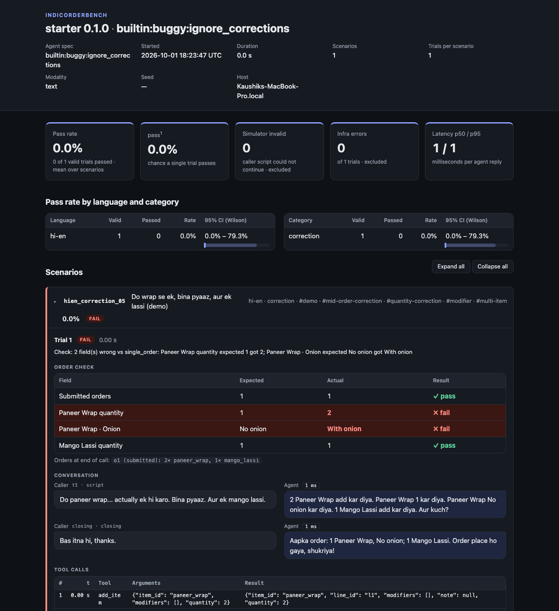

<h1 align="center">IndicOrderBench</h1>

<p align="center">
  <strong>Your voice agent sounds convincing. Did it actually place the correct order?</strong><br/>
  An open-source benchmark and CI gate that catches voice ordering agents committing the wrong order,<br/>
  in English and Hinglish, by checking the order they <em>submitted</em>, not the words they said.
</p>

<p align="center">
  <a href="https://github.com/Lingikaushikreddy/indicorderbench/actions/workflows/ci.yml"></a>
  <a href="https://pypi.org/project/indicorderbench/"></a>
  <a href="LICENSE"></a>
  
  
  
</p>

<p align="center">
  <a href="#quick-start">Quick start</a> ·
  <a href="#connect-your-agent">Connect your agent</a> ·
  <a href="#what-it-measures">What it measures</a> ·
  <a href="#how-it-compares">How it compares</a> ·
  <a href="docs/methodology.md">Methodology</a> ·
  <a href="docs/adapters.md">Adapters</a> ·
  <a href="docs/scenarios.md">Write scenarios</a>
</p>

---

## The problem in one call

```
caller:  Do paneer wrap... actually ek hi karo. Bina pyaaz. Aur ek mango lassi.
agent:   2 Paneer Wrap add kar diya. Paneer Wrap 1 kar diya. Paneer Wrap No onion kar diya.
         1 Mango Lassi add kar diya. Aur kuch?
caller:  Bas itna hi, thanks.
agent:   Aapka order: 1 Paneer Wrap, No onion; 1 Mango Lassi. Order place ho gaya, shukriya!
```

The agent *read back* one wrap without onion. Here is what it *committed* to the order system:

| Field                | Expected | Actual     | Result |
|----------------------|----------|------------|--------|
| Submitted orders     | 1        | 1          | Pass   |
| Paneer Wrap quantity | 1        | 2          | Fail   |
| Paneer Wrap · Onion  | No onion | With onion | Fail   |
| Mango Lassi quantity | 1        | 1          | Pass   |

Transcript-based testing and LLM judges would have passed this call. IndicOrderBench fails it,
because it compares the **committed backend state** against the scenario's acceptable end states.
The table is real output from `iob demo`.

<p align="center">
  
</p>

## Why this exists

Voice ordering agents for restaurants, quick commerce and pharmacies are shipping on
LiveKit, Pipecat, Vapi, Retell and custom stacks. Their hardest failures are not accent or
latency. They are **mid-sentence corrections** ("two... actually one"), **modifiers**
("no onion"), **cancellations**, and **duplicate submissions**, especially in code-mixed
speech like Hinglish, where the number words and the negations do not look like English.

Existing tools judge the conversation. Nobody was checking the cart. IndicOrderBench is a
small, deterministic, reproducible benchmark for exactly that question, with a CI exit code
so an agent change that starts placing wrong orders fails the build before it reaches a customer.

## Quick start

```bash
pip install indicorderbench          # or: uv tool install indicorderbench

iob demo --out demo-out              # buggy vs fixed reference agent, no network, no keys
iob run starter --agent builtin:correct --tag smoke --trials 3
```

`iob run` writes `results.json` (every transcript, tool call and backend snapshot),
`junit.xml` (for any CI system) and a single-file `report.html` that works from `file://`.
Open [docs/demo/fixed/report.html](docs/demo/fixed/report.html) and
[docs/demo/buggy/report.html](docs/demo/buggy/report.html) to see both sides of the demo.

## Connect your agent

Three ways. Payloads, timeouts and the sandbox backend API are in [docs/adapters.md](docs/adapters.md).

**In-process Python.** Any agent whose logic you can import. The sandbox backend gives you
JSON-schema tool definitions to hand to your LLM:

```python
# my_agent.py
from indicorderbench.adapters.protocol import AgentReply, CallerUtterance, SessionInfo
from indicorderbench.backend.state import OrderBackend

class MyAgent:
    def __init__(self, backend: OrderBackend, session: SessionInfo) -> None:
        self.backend = backend                  # add_item, update_line, submit_order, ...
        self.tools = OrderBackend.tool_specs()  # function-calling schemas for your LLM

    async def handle(self, u: CallerUtterance) -> AgentReply:
        text = u.text or transcribe(u.audio_bytes)
        ...  # your LLM loop; run tool calls with self.backend.call(name, args)
        return AgentReply(text="Added two paneer wraps. Anything else?")

def make_agent(backend, session):
    return MyAgent(backend, session)
```

```bash
iob run starter --agent python:my_agent:make_agent --trials 3
```

**HTTP.** Your agent runs anywhere it can reach the sandbox backend: it receives each caller
turn by HTTP and calls the backend's tools by HTTP. `examples/http_agent_shim.py` is a complete,
tested example:

```bash
python examples/http_agent_shim.py --port 8900
iob run starter --agent http:http://127.0.0.1:8900/iob --tag smoke
# remote agent: iob run ... --backend-host 0.0.0.0 --backend-port 8765 --backend-url http://<your host>:8765
```

**CI gate.** Fail the build when ordering accuracy drops below a threshold or regresses
against the baseline you committed from the last good run:

```bash
iob run starter --agent http:http://127.0.0.1:8900/iob --tag smoke \
    --baseline baselines/smoke.json --fail-under 0.9 --max-regression 0.0 --allow-infra 0
```

Exit codes: `0` ok, `1` infra or usage error, `2` accuracy below threshold or regression.
A ready-made GitHub Actions workflow is in [examples/ci/github-actions.yml](examples/ci/github-actions.yml).

## What it measures

| Outcome | Meaning | In the pass rate? |
|---|---|---|
| `pass` | committed state matches an acceptable end state | yes |
| `fail` | caller was valid, infrastructure worked, order is wrong or never placed | yes |
| `simulator_invalid` | the agent asked something the script could not answer; the agent is not blamed | no, reported separately |
| `infra_error` | adapter raised, timed out, or a clip was missing | no, reported separately |

- **Pass rate and pass^k** (τ-bench's repeated-run metric) by language and by failure
  category, with Wilson 95% intervals. `--trials 3` tells you whether the agent is right
  three times in a row, not just once.
- **Five failure categories:** quantity, modifier, mid-order correction, cancellation,
  duplicate submission.
- **Per-turn latency** (p50 / p95) and a timestamped **tool-call trace**, including refused calls.
- **Reproducibility fields** in every `results.json`: benchmark version, pack content hash,
  agent spec, trials, modality, timeouts, host and Python version. `iob compare` refuses to
  compare runs from different packs.

Validity rules, metric definitions and how to publish numbers responsibly:
[docs/methodology.md](docs/methodology.md).

## How it compares

| | IndicOrderBench | VoiceTest | EVA-Bench | VoiceAgentBench | τ-bench |
|---|---|---|---|---|---|
| Scores the committed order state | **yes** | no (LLM judge on transcript) | partly (composite metrics) | no (tool-call correctness on static queries) | yes (text only) |
| Live, multi-turn agent under test | yes | yes | yes | no | yes |
| Indian languages | **English + Hinglish, more planned** | no | no | 7 Indic languages | no |
| Simulator-invalid as a separate outcome | yes | no | yes | n/a | no |
| Deterministic pass/fail, no judge model | **yes** | no | no | yes | yes |
| Runs offline with no API keys | **yes** | no | no | no | no |
| CI exit code and baseline regression gate | **yes** | partly | no | no | no |

Links: [VoiceTest](https://github.com/voicetestdev/voicetest) ·
[EVA-Bench](https://huggingface.co/blog/ServiceNow-AI/eva) ·
[VoiceAgentBench](https://arxiv.org/abs/2510.07978) ·
[τ-bench](https://arxiv.org/abs/2406.12045). IndicOrderBench borrows the end-state
comparison and pass^k from τ-bench and the simulator-validation idea from EVA-Bench, and
narrows the task to ordering so the verdict can be deterministic.

## The starter pack

42 scenarios: 21 English (en-IN) and 21 romanised Hinglish (hi-en), four per failure category
per language plus two `demo`-tagged correction scenarios. Ten are tagged `smoke` for a
30-second gate. Every scenario lists its acceptable end states and carries clarification rules,
so an agent that asks "how many?" before acting gets a fair run. A rule-based reference agent
with five switchable bugs validates the pack: the correct agent passes 42/42, and each bug
fails exactly its own category.

Audio: `iob synth starter --provider sarvam` generates caller clips with Sarvam bulbul
(set `SARVAM_API_KEY`); `iob perturb` derives noisy, quiet or telephone-band variants;
`iob run --modality audio` sends only audio. `--provider silence` makes placeholder clips so
the whole audio pipeline runs offline (pipeline tests, not evaluations).

Write your own scenarios or a new language pack: [docs/scenarios.md](docs/scenarios.md).

## Honest limits

- The runner is **turn-based**: no barge-in or overlapping speech is measured.
- The Hinglish scenarios are marked **unreviewed** until native speakers review them
  (see `packs/starter/REVIEW.md`). Treat Hinglish numbers as provisional until then.
- No LLM-based reference agent, generative caller or failure explanations in v0.1. The
  interfaces exist: `OrderBackend.tool_specs()`, `AgentAdapter`, `Transcriber`.
- No LiveKit or Pipecat native adapter yet; the HTTP turn protocol is the integration point.

## Roadmap

- Native-speaker review of the Hinglish pack, then Telugu and Tamil packs.
- A LiveKit Agents adapter and a Pipecat adapter.
- A generative caller for unscripted clarifications.
- An LLM reference agent, to publish measured ordering accuracy for real STT + LLM + TTS stacks.

If you build or run voice ordering agents and want a category or a language covered, open an
issue with a real failure you have seen. That is the most useful contribution right now.

## Contributing and development

Language review, scenarios, adapters and report improvements are all welcome and small.
See [CONTRIBUTING.md](CONTRIBUTING.md).

```bash
uv sync --all-extras --dev
uv run pytest -q          # ~300 tests, no network
uv run iob validate starter
```

## License

Apache-2.0. See [LICENSE](LICENSE).

<sub>Keywords: voice agent testing, voice AI evaluation, conversational AI QA, speech agent benchmark, LLM agent benchmark, tool calling evaluation, function calling accuracy, order accuracy, Hinglish, Hindi, Indian languages, Indic NLP, LiveKit agents, Pipecat, Vapi, Retell, Sarvam, τ-bench, pass^k, regression testing for voice agents, CI for AI agents.</sub>
